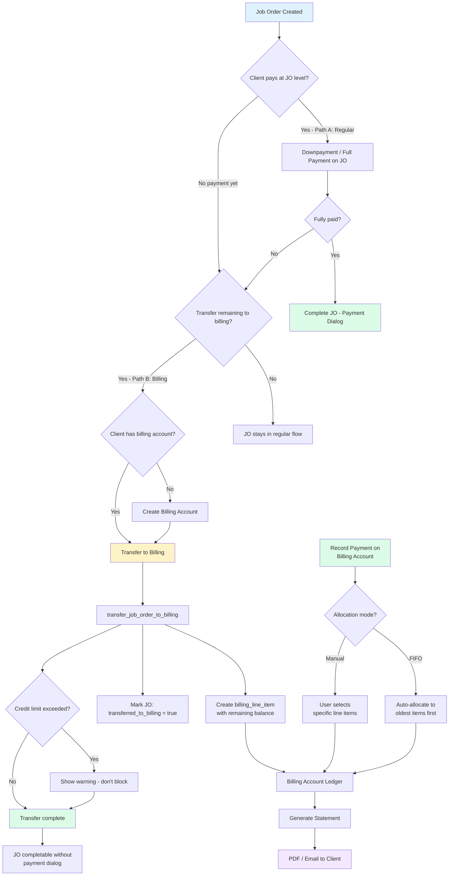
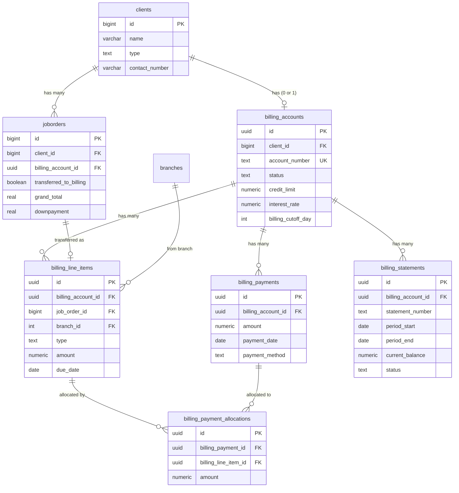
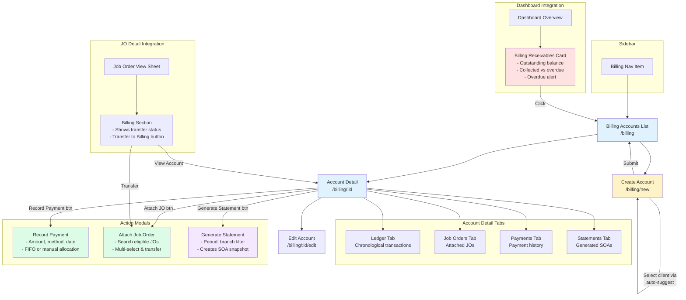
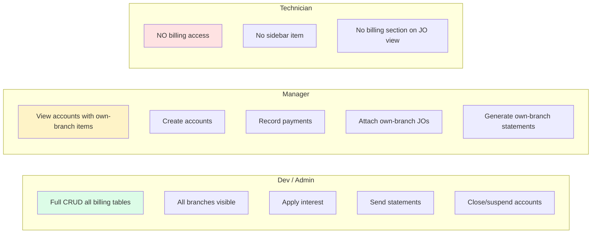
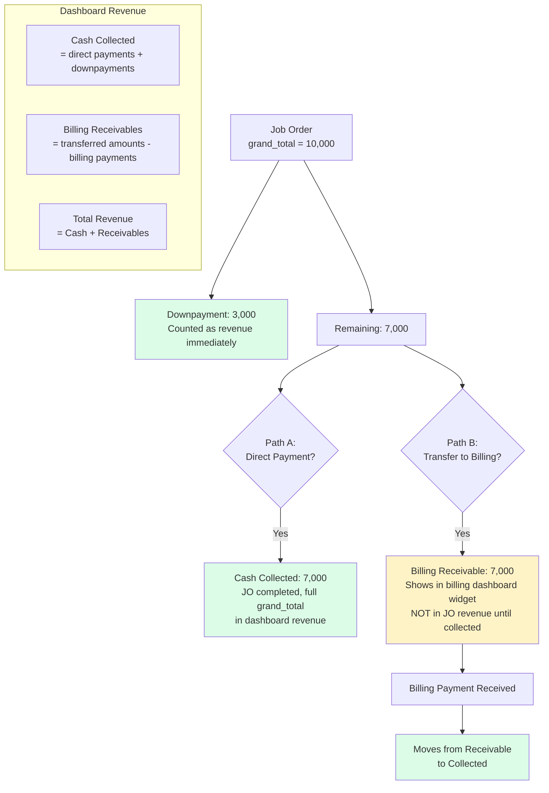

# Billing System (SOA) - Phase 3 Workflow Diagrams

## 1. System Workflow - Transfer & Payment Flow

## 2. Data Flow - Database Schema

## 3. Frontend User Flow

## 4. RBAC Access Matrix

## 5. Revenue Flow (No Double-Counting)

