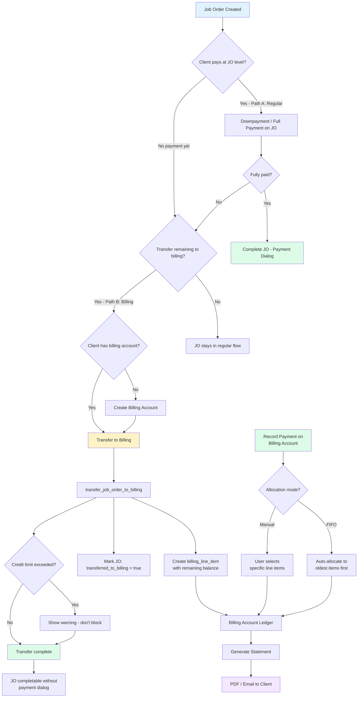
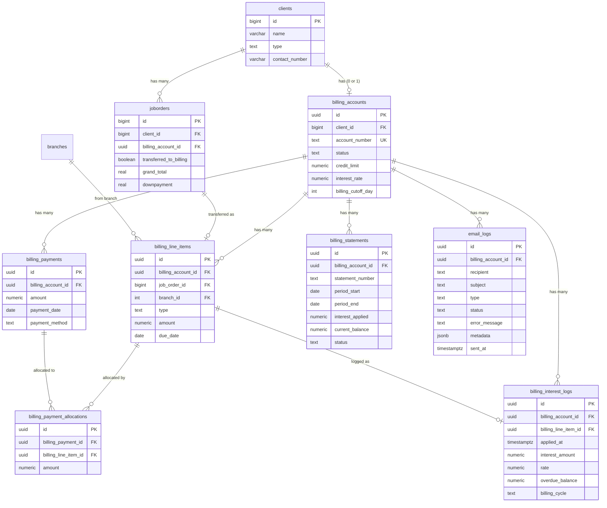
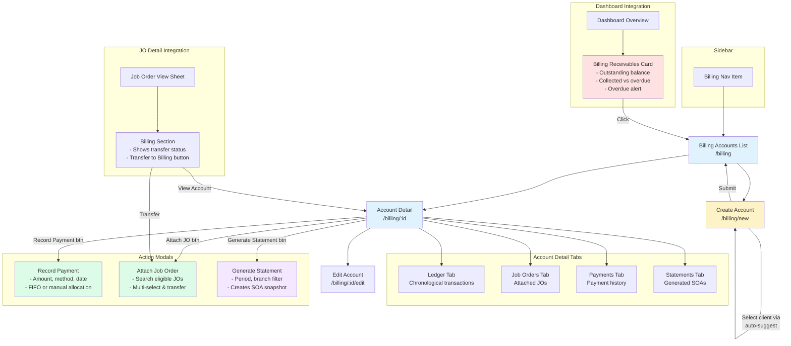
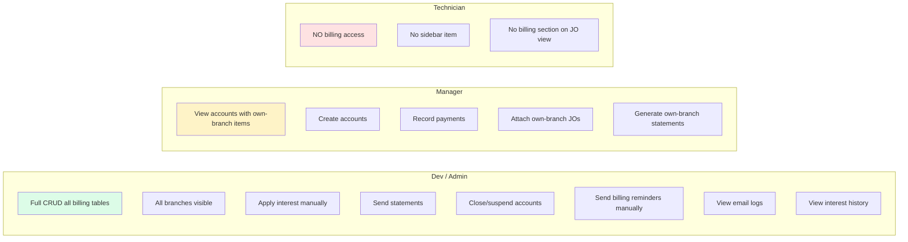
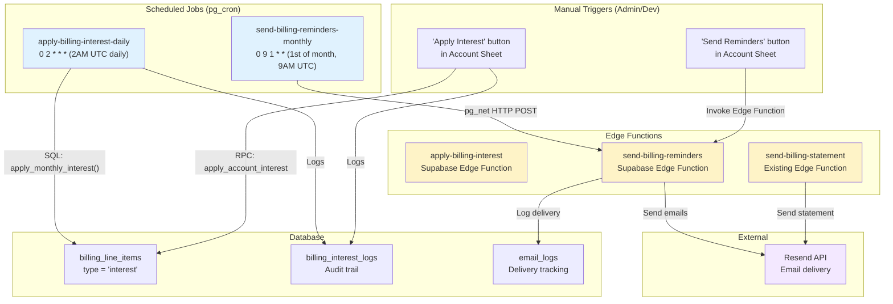
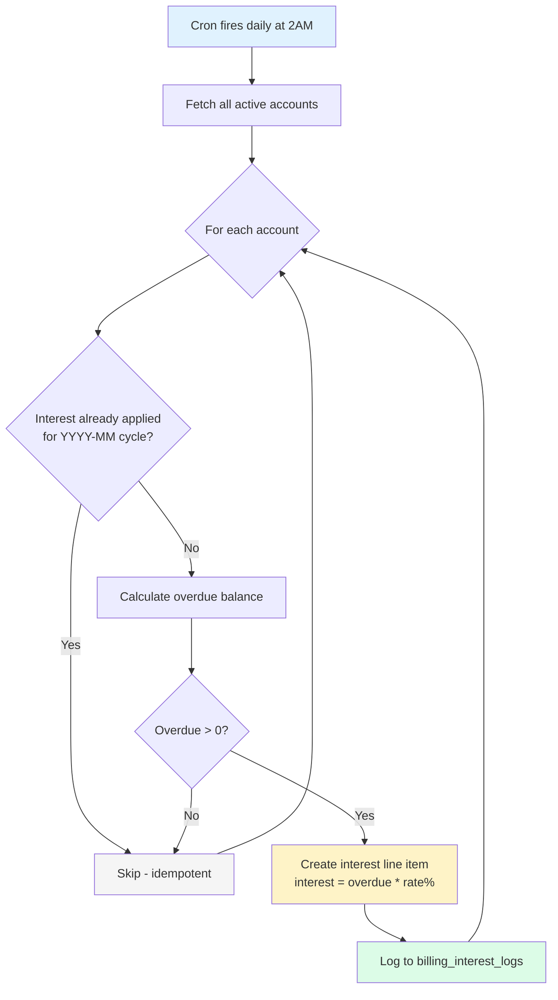
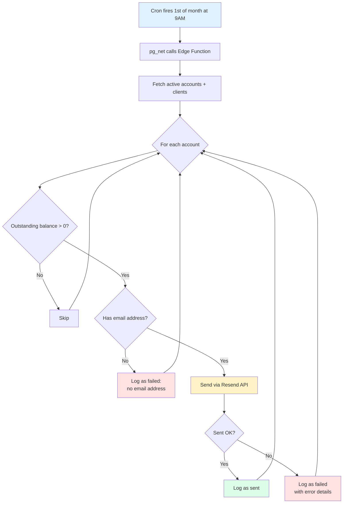
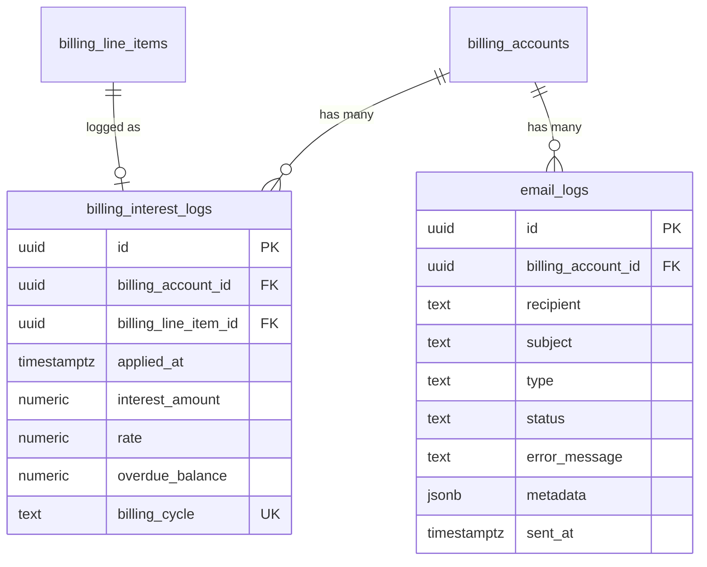
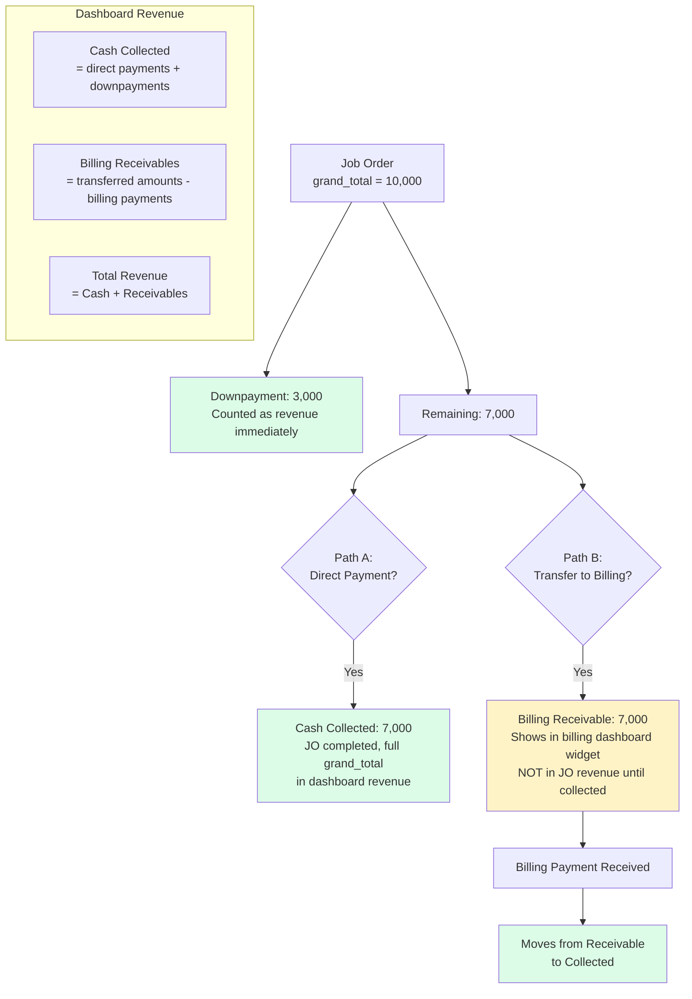

# Billing System (SOA) - Phase 3 Workflow Diagrams

## 1. System Workflow - Transfer & Payment Flow

## 2. Data Flow - Database Schema

## 3. Frontend User Flow

## 4. RBAC Access Matrix

## 5. Automated Billing System

### 5.1 Architecture Overview

### 5.2 Automated Interest Application

**Schedule:** Daily at 2:00 AM UTC via `pg_cron`

**Logic:**
1. Iterates all active billing accounts
2. For each account, checks `billing_interest_logs` for existing entry in current billing cycle (YYYY-MM)
3. If already applied for this cycle, **skips** (idempotency guarantee)
4. Calculates overdue balance from `billing_line_items` (past due_date, not fully paid)
5. Applies interest: `interest_amount = overdue_balance * (interest_rate / 100)`
6. Creates a `billing_line_items` entry with `type = 'interest'`
7. Logs to `billing_interest_logs` with cycle, rate, and overdue balance

**Idempotency:** Unique constraint on `(billing_account_id, billing_cycle)` in `billing_interest_logs` prevents duplicate interest per month.

### 5.3 Automated Email Reminders

**Schedule:** 1st of every month at 9:00 AM UTC via `pg_cron` + `pg_net`

**Logic:**
1. Fetches all active billing accounts with client info
2. Gets outstanding balance via `get_billing_account_balance` RPC
3. Skips accounts with zero or negative balance
4. Determines recipient email (billing contact > client email)
5. Sends HTML reminder email via Resend API
6. Logs every attempt to `email_logs` table (pending > sent/failed)

**Email Content:**
- Account number, client name
- Amount due (formatted as Philippine Peso)
- Due date (based on billing cutoff day)
- Interest rate warning

### 5.4 New Database Tables

### 5.5 Configuration & Secrets

| Secret | Purpose | Where Set |
|--------|---------|-----------|
| `RESEND_API_KEY` | Email sending via Resend API | Supabase Dashboard > Edge Function Secrets |
| `SUPABASE_SERVICE_ROLE_KEY` | Auto-available in Edge Functions | Built-in |
| `SUPABASE_URL` | Auto-available in Edge Functions | Built-in |

### 5.6 Edge Functions

| Function | Trigger | Purpose |
|----------|---------|---------|
| `send-billing-reminders` | Cron (monthly) or manual POST | Send billing reminder emails to all active accounts with outstanding balance |
| `apply-billing-interest` | Cron (daily) or manual POST | Apply interest to overdue accounts (idempotent per billing cycle) |
| `generate-billing-statements` | Cron (monthly) or manual POST | Auto-generate SOA for previous period, finalize, and email to clients |
| `send-billing-statement` | Manual (from UI) | Send a specific statement of account via email |

### 5.7 Cron Schedules

| Job Name | Schedule | Action |
|----------|----------|--------|
| `apply-billing-interest-daily` | `0 2 * * *` (daily 2AM UTC) | HTTP POST to `apply-billing-interest` edge function via `pg_net` |
| `send-billing-reminders-monthly` | `0 9 1 * *` (1st of month 9AM UTC) | HTTP POST to `send-billing-reminders` edge function via `pg_net` |
| `generate-billing-statements-monthly` | `0 10 2 * *` (2nd of month 10AM UTC) | HTTP POST to `generate-billing-statements` edge function via `pg_net` |

### 5.8 UI Additions

- **Balance Summary**: Shows charges subtotal, interest applied, and total due breakdown
- **Statements Table**: New "Interest" column showing `interest_applied` per statement period
- **Interest History Section**: Collapsible table showing all interest applications with cycle, rate, and amounts
- **Email History Section**: Collapsible table showing all sent/failed emails with status and error details (admin/dev only)
- **Send Reminders Button**: Manual trigger for admin/dev to send billing reminders immediately
- **Apply Interest Button**: Existing button now has idempotency - prevents duplicate interest per billing cycle

## 6. Revenue Flow (No Double-Counting)

